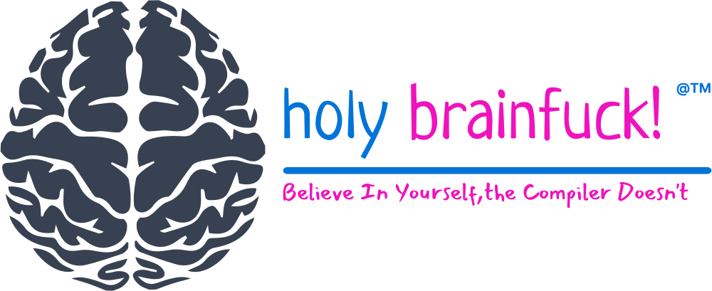
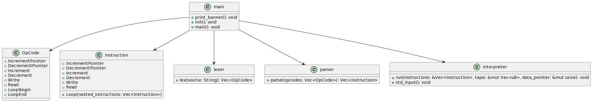
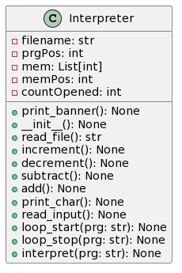
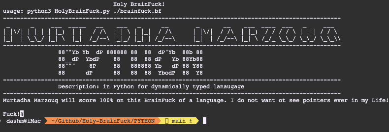
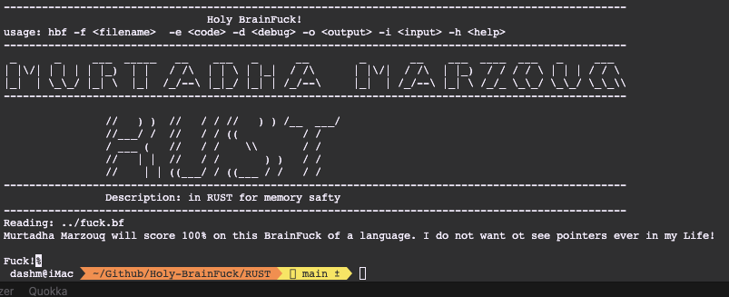
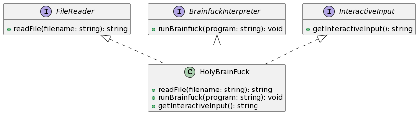
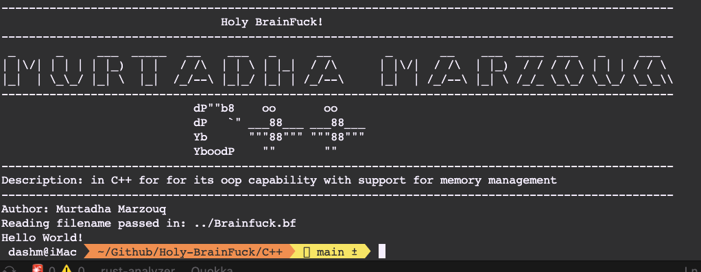

# HBF - Holy Brain Fuck!

 

<a href="http://findasnake.com"></a>

---


hbf or (Holy Brain Fuck ) is a small project I created to help me learn more about programming languages
Function: It takes in a brainfuck source code and interprets it in Rust like a. This maybe a front to all thing good and holy but it was fun. It is like cursing but in shakespearean style

---
## Resources:

---


##### Here are some useful links related to Brainfuck that I used:


- [Article by Ben Wendt](https://benwendt.ca/articles/converting-to-bf)
- [Brainfuck Visualizer Logo](https://github.com/usaikiran/brainfuck-visualizer)
- [The Rust Book](https://doc.rust-lang.org/book/) 
- [The Brainfuck Programming Language](http://www.muppetlabs.com/~breadbox/bf/) 
- [Brainfuck Derivatives](https://esolangs.org/wiki/Category:Brainfuck_derivatives) 
- [Minimal Languages](http://www.chriswarbo.net/blog/2014-12-22-minimal_languages.html) 

- [Walkthrough Video](https://www.youtube.com/watch?v=4uNM73pfJn0) 


## Motivations:


| Language | Compilation | Memory Management | Performance | Syntax and Semantics | Type System | Paradigms |
| --- | --- | --- | --- | --- | --- | --- |
|  | Compiled | Ownership and borrowing | Comparable to C++, optimized for performance | C-like syntax with {} and ; | Algebraic data type system with enums, trait bounds, lifetimes, etc. | Functional and imperative |
| | Compiled | Manual memory management with new/delete and smart pointers | Comparable to Rust, optimized for performance | C-like syntax with {} and ; | Sophisticated type system with templates, inheritance and operator overloading | Object-oriented, functional and imperative |
|  | Interpreted | Automatic garbage collection | Slower than Rust and C++ | Clean, simple syntax with indentation for blocks and no ; | Dynamically typed, types assigned at runtime | Primarily object-oriented |

### UML Diagrams:


```diff

- C++:
+ FileReader: Reads the file and returns a string
+ Tokenizer: Tokenizes the string and returns a vector of tokens
+ Interpreter: Interprets the tokens and returns the output

```







## Plan:


#### The eight commands are:

| Command | Description |
| --- | --- |
| `>` | Increment the data pointer |
| `<` | Decrement the data pointer |
| `+` | Increment the byte at the data pointer |
| `-` | Decrement the byte at the data pointer |
| `.` | Output the byte at the data pointer |
| `,` | Input a byte and store it in the byte at the data pointer |
| `[` | Jump forward past the matching `]` if the byte at the data pointer is zero |
| `]` | Jump backward to the matching `[` if the byte at the data pointer is nonzero |


## Implementations


---
###  

```fish
A high-level, interpreted programming language with an emphasis on code readability. It is garbage-collected and dynamically typed.
Implement the interpreter using classes for the different tokens and operations
```



##  

```fish
a multi-paradigm, general-purpose programming language with a focus on efficiency, type safety, and concurrency. It ensures memory safety by employing a Borrow-Checker.
Implement the interpreter using vectors and immutable variables.
```




###  

```fish

A flexible and powerful programming language. Pointers, functions, classes, and templates are all well explained.
Implement the interpreter using vectors and pointers, and iterate over the input stream.

```



---

## POC:
---


## Author
---
<a href="http://findasnake.com"></a>

### Murtadha Marzouq


